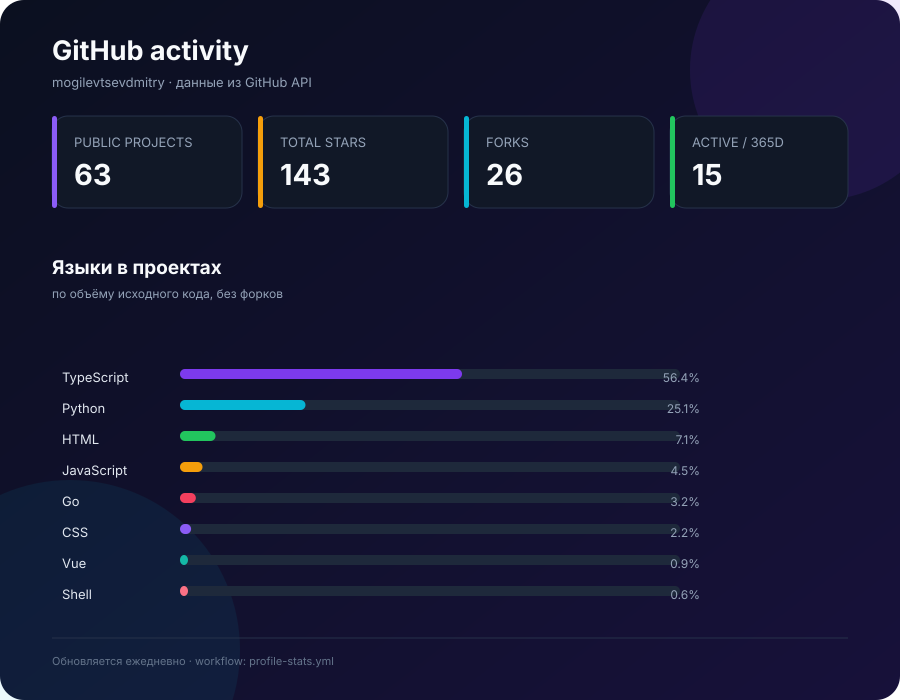
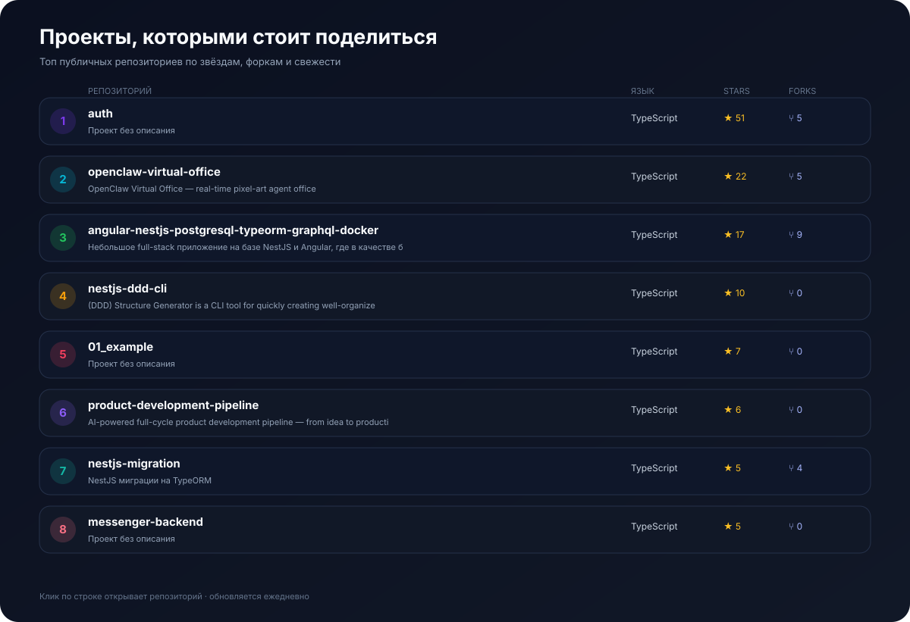

  
  <h1>Дмитрий Могилевцев</h1>
  
<strong>Senior Node.js Backend Developer · AI / Agent Engineer · Solo founder</strong>

  
Строю надёжные backend-сервисы и продукты с ИИ — от архитектуры и API до CI/CD и продакшена.

  
<a href="https://t.me/mogilevtsevdmitry">Telegram</a> · <a href="mailto:webmogilevtsev@ya.ru">Email</a> · <a href="https://github.com/mogilevtsevdmitry">GitHub</a>

  
📍 Тюмень, Россия · UTC+5

  
  
  
  
  
  

---

## Обо мне

Я backend-разработчик с фокусом на Node.js/NestJS, архитектуру и автоматизацию. Днём создаю сервисы для сложного финтех- и государственного домена в ДОМ.РФ, а параллельно развиваю свои продукты и виртуальную команду AI-агентов.

Мой рабочий фокус — не «вау-демо», а системы, которые можно поддерживать, тестировать и уверенно выводить в прод: понятные контракты, наблюдаемость, миграции без сюрпризов, CI/CD и аккуратная работа с данными.

## Что умею

<table>
  <tr><td width="50%" valign="top"><h3>Backend & architecture</h3>
<code>TypeScript</code> <code>Node.js</code> <code>NestJS</code> <code>Prisma</code> <code>TypeORM</code> <code>Knex</code> <code>REST</code> <code>OpenAPI / Swagger</code> <code>GraphQL</code> <code>SSE</code> <code>WebSocket</code>

<code>DDD</code> <code>Clean Architecture</code> <code>SOLID</code> <code>CQRS</code> <code>Event Sourcing</code> <code>интеграции</code> <code>highload</code>
</td><td width="50%" valign="top"><h3>Data & messaging</h3>
<code>PostgreSQL</code> <code>Redis</code> <code>RabbitMQ</code> <code>MongoDB</code> <code>SQLite</code> <code>Kafka</code> <code>S3</code> <code>MinIO</code>

Оптимизация SQL, проектирование схем, миграции, очереди и событийные интеграции.
</td></tr>
  <tr><td valign="top"><h3>Frontend & product</h3>
<code>React</code> <code>Next.js</code> <code>Angular</code> <code>JavaScript</code> <code>Vite</code> <code>Tailwind</code> <code>Phaser</code> <code>Three.js</code> <code>Figma</code>

От лендингов и кабинетов до браузерных игр и full-stack прототипов.
</td><td valign="top"><h3>AI & automation</h3>
<code>OpenAI</code> <code>Claude / Anthropic</code> <code>Ollama</code> <code>Llama</code> <code>Qwen</code> <code>DeepSeek</code> <code>Whisper</code> <code>STT / TTS</code>

RAG, гибридный поиск, evals, prompt engineering, anti-hallucination и multi-agent orchestration.
</td></tr>
  <tr><td valign="top"><h3>DevOps & delivery</h3>
<code>Docker</code> <code>Docker Swarm</code> <code>Dokploy</code> <code>GitHub Actions</code> <code>GitLab CI/CD</code> <code>Cloudflare</code> <code>Nginx</code> <code>VPS</code> <code>Kubernetes</code>
</td><td valign="top"><h3>Quality & integrations</h3>
<code>Jest</code> <code>Playwright</code> <code>Cypress</code> <code>Postman</code> <code>Telegram bots</code> <code>ЮKassa</code> <code>Т-Банк</code> <code>Python</code> <code>Go</code>
</td></tr>
</table>

## Избранные направления

- **AI-продукты и SaaS:** СметаКП, Reply Desk, AI-фабрика и виртуальный офис агентов.
- **Инженерные инструменты:** `nestjs-ddd-cli`, шаблоны микросервисов, backend-модули и автоматизация delivery.
- **Продуктовая разработка:** от идеи и доменной модели до платежей, аналитики и деплоя.

## Навигация по репозиториям

| Группа | Репозитории | Фокус |
| --- | --- | --- |
| AI-платформа | [openclaw-virtual-office](https://github.com/mogilevtsevdmitry/openclaw-virtual-office) · [product-development-pipeline](https://github.com/mogilevtsevdmitry/product-development-pipeline) · [agent_orchestrator](https://github.com/mogilevtsevdmitry/agent_orchestrator) | агенты, workflow, runtime и realtime-наблюдаемость |
| SaaS и продукты | [reply-desk](https://github.com/mogilevtsevdmitry/reply-desk) · [chronos-platform](https://github.com/mogilevtsevdmitry/chronos-platform) · [my-portfolio](https://github.com/mogilevtsevdmitry/my-portfolio) | прикладные сервисы и продуктовая разработка |
| OSS и backend | [nestjs-ddd-cli](https://github.com/mogilevtsevdmitry/nestjs-ddd-cli) · [auth](https://github.com/mogilevtsevdmitry/auth) | NestJS, DDD, API и reusable tooling |
| Визуальные эксперименты | [night-hunt-cat-game](https://github.com/mogilevtsevdmitry/night-hunt-cat-game) · [neon-heist](https://github.com/mogilevtsevdmitry/neon-heist) | Three.js, Phaser и браузерные прототипы |

Исторические учебные и архивные репозитории переведены в состояние **Archived** и не учитываются в статистике активных проектов.

## GitHub статистика

Статистика строится внутри репозитория GitHub Actions и сохраняется локально в SVG. Архивные репозитории не учитываются, поэтому блок показывает актуальную активную часть профиля и не зависит от `github-readme-stats.vercel.app`, который периодически недоступен.

## Проекты

Открыт к продуктовым задачам, AI-интеграциям и сложному backend. Связь: <a href="https://t.me/mogilevtsevdmitry">@mogilevtsevdmitry</a>

